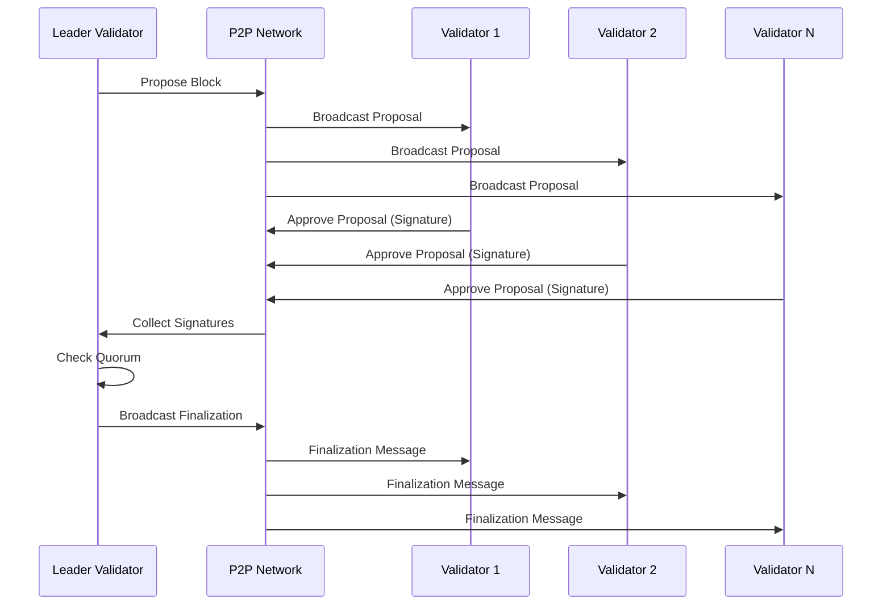

# SHPoNU Consensus Protocol

## Overview

The Streamlined Hierarchical Proof of Network Utility (SHPoNU) consensus protocol is a lightweight and high-performance consensus mechanism designed for efficient validation and propagation of network states. It is particularly well-suited for high-throughput, low-latency use cases, leveraging the Threshold BLS cryptographic scheme for efficient aggregation and verification of validator signatures.

### Key Components

- Validators: Nodes in the network responsible for proposing, validating, and finalizing blocks. Validators are organized in a hierarchical structure to improve the efficiency of message propagation and consensus.
- Proposals: Validators propose new blocks to be added to the network state. The protocol ensures that only the leader (elected from the validator set) can propose new blocks.
- Approvals: Other validators approve or reject proposed blocks based on their local state and the proposal’s validity.
- Finalization: Once a quorum of validators has approved a block, it can be finalized and added to the network state.

## Consensus Flow

The consensus mechanism operates in a sequence of steps:

- Block Proposal: The leader validator proposes a new block.
- Proposal Broadcast: The proposal is broadcast to all other validators.
- Approval: Validators verify the proposal and send their approvals (signatures) back to the leader.
- Quorum Check: If the leader detects that a quorum of approvals has been reached, it finalizes the block and propagates the finalization message.
- Finalization: Validators accept the finalization message and update their local state.

## Sequence Diagram

The sequence diagram below outlines the interactions between the leader validator, the network, and other validators during the consensus process.




## Protocol Workflow

- Initialization: The consensus protocol is initialized with a set of validators and a configured quorum size.
- Leader Election: The leader is elected among the validators to propose a new block for each consensus round.
- Block Proposal: The elected leader proposes a new block. The proposal contains:
  - The block data.
  - The leader’s ID.
  - A signature generated using the leader’s private key.
- Broadcast Proposal: The proposal is broadcast to all other validators in the network. Each validator receives the proposal and verifies:
  - The validity of the block data.
  - The authenticity of the leader’s signature.
- Approval: Validators approve the block by signing the proposal hash with their private keys. The approval contains:
  - The validator’s ID.
  - The block hash.
  - The validator’s signature.
- Quorum Check: The leader collects approvals from validators. Once the number of approvals reaches the quorum threshold, the leader finalizes the block.
- Finalization: The finalized block is broadcast to all validators, who update their local state.

## Validator Set and Leader Election

- Validator Set: The set of validators is managed dynamically, with validators joining and leaving based on their stake and reputation.
- Leader Election: A new leader is elected for each consensus round. The election can be based on a round-robin mechanism, random selection, or a weighted mechanism based on the validator’s stake.

## Message Types

The SHPoNU protocol defines three primary message types:

- Proposal Message: Sent by the leader to propose a new block.
- Approval Message: Sent by validators to approve a proposal.
- Finalization Message: Sent by the leader to finalize a block after quorum is reached.

## Message Structure

All messages contain the following fields:

- Message Type: Specifies whether the message is a proposal, approval, or finalization.
- Block Hash: The hash of the proposed block.
- Validator ID: The ID of the validator sending the message.
- Signature: The BLS signature of the message content.

## Example Message Structure (in JSON format)

```json
{
  "type": "Proposal",
  "blockHash": "b3c3e1a1...",
  "validatorID": "12D3KooW...",
  "signature": "af83e1..."
}
```


## Threshold BLS Signatures

The SHPoNU protocol uses Threshold BLS (Boneh-Lynn-Shacham) signatures for efficient aggregation and verification. Threshold BLS allows for the aggregation of multiple signatures into a single compact signature, reducing communication overhead and enabling scalable consensus.
BLS Signature Operations

- Signing: Each validator signs the block hash using their private BLS key.
- Aggregation: The signatures are aggregated into a single signature.
- Verification: The aggregated signature is verified using the public keys of all participating validators.

## Advantages of BLS Signatures

- Compactness: Multiple signatures can be combined into a single signature.
- Efficient Verification: The combined signature can be verified in constant time, regardless of the number of individual signatures.

## Consensus State Management

The consensus state is managed using a key-value store (e.g., MDBX) and includes:

- Proposals: All pending block proposals.
- Approvals: Validator approvals for each block proposal.
- Finalized Blocks: A list of all finalized blocks.

The state is persisted to the storage layer, ensuring crash consistency and enabling fast recovery in case of node failure.

## State Transitions

- Initial State: No proposals exist, and no blocks are finalized.
- Proposal State: A new proposal is added to the state when proposed by the leader.
- Approval State: The state transitions to the approval state when validators approve the proposal.
- Finalized State: The proposal is marked as finalized once the leader detects that a quorum of approvals has been reached.

## Security and Fault Tolerance

The SHPoNU protocol is designed to be resilient against network partitions and malicious behavior:

- Fault Tolerance: SHPoNU can tolerate up to f faulty or malicious nodes in a network of 3f+1 nodes.
- Signature Verification: All messages are signed and verified using BLS signatures to prevent spoofing and ensure authenticity.
- Leader Rotation: Leaders are rotated frequently to prevent single points of failure.

## Conclusion

The SHPoNU consensus protocol is a robust and efficient mechanism for managing network state in high-throughput, low-latency environments. Its use of Threshold BLS signatures, dynamic validator sets, and efficient state management makes it well-suited for real-time applications like decentralized finance (DeFi) and high-frequency trading (HFT) systems.
