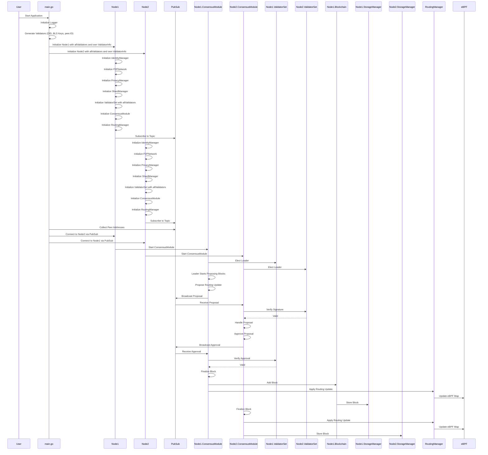

# PeerDNS

To be announced in the future...

## Unsorted - dummy not to forget...

```
sudo mkdir /var/.peerdns/
sudo mkdir /var/.peerdns/keystore
sudo chown xx:xx -R /var/.peerdns/
```

## Sequence Diagram
The following sequence diagram illustrates the interactions between different components during the initialization and consensus processes.

