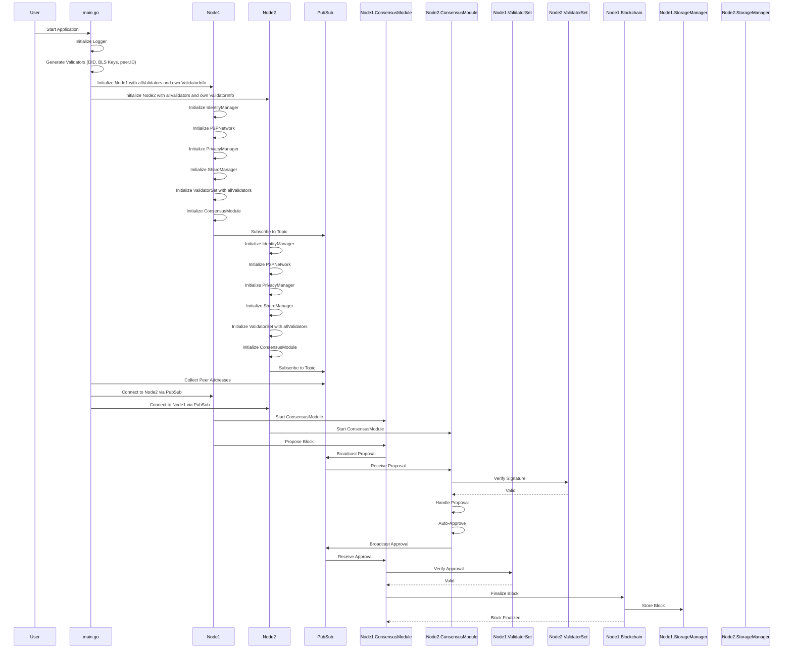

# PeerDNS

To be announced in the future...

```mermaid
sequenceDiagram
    participant User as User
    participant Main as main.go
    participant Node1 as Node1
    participant Node2 as Node2
    participant PubSub as PubSub
    participant Consensus1 as Node1.ConsensusModule
    participant Consensus2 as Node2.ConsensusModule
    participant ValidatorSet1 as Node1.ValidatorSet
    participant ValidatorSet2 as Node2.ValidatorSet
    participant Blockchain1 as Node1.Blockchain
    participant Storage1 as Node1.StorageManager
    participant Storage2 as Node2.StorageManager

    User->>Main: Start Application
    Main->>Main: Initialize Logger
    Main->>Main: Generate Validators (DID, BLS Keys, peer.ID)
    Main->>Node1: Initialize Node1 with allValidators and own ValidatorInfo
    Main->>Node2: Initialize Node2 with allValidators and own ValidatorInfo
    Node1->>Node1: Initialize IdentityManager
    Node1->>Node1: Initialize P2PNetwork
    Node1->>Node1: Initialize PrivacyManager
    Node1->>Node1: Initialize ShardManager
    Node1->>Node1: Initialize ValidatorSet with allValidators
    Node1->>Node1: Initialize ConsensusModule
    Node1->>PubSub: Subscribe to Topic
    Node2->>Node2: Initialize IdentityManager
    Node2->>Node2: Initialize P2PNetwork
    Node2->>Node2: Initialize PrivacyManager
    Node2->>Node2: Initialize ShardManager
    Node2->>Node2: Initialize ValidatorSet with allValidators
    Node2->>Node2: Initialize ConsensusModule
    Node2->>PubSub: Subscribe to Topic
    Main->>PubSub: Collect Peer Addresses
    Main->>Node1: Connect to Node2 via PubSub
    Main->>Node2: Connect to Node1 via PubSub
    Node1->>Consensus1: Start ConsensusModule
    Node2->>Consensus2: Start ConsensusModule
    Node1->>Consensus1: Propose Block
    Consensus1->>PubSub: Broadcast Proposal
    PubSub->>Consensus2: Receive Proposal
    Consensus2->>ValidatorSet2: Verify Signature
    ValidatorSet2-->>Consensus2: Valid
    Consensus2->>Consensus2: Handle Proposal
    Consensus2->>Consensus2: Auto-Approve
    Consensus2->>PubSub: Broadcast Approval
    PubSub->>Consensus1: Receive Approval
    Consensus1->>ValidatorSet1: Verify Approval
    ValidatorSet1-->>Consensus1: Valid
    Consensus1->>Blockchain1: Finalize Block
    Blockchain1->>Storage1: Store Block
    Blockchain1-->>Consensus1: Block Finalized
```